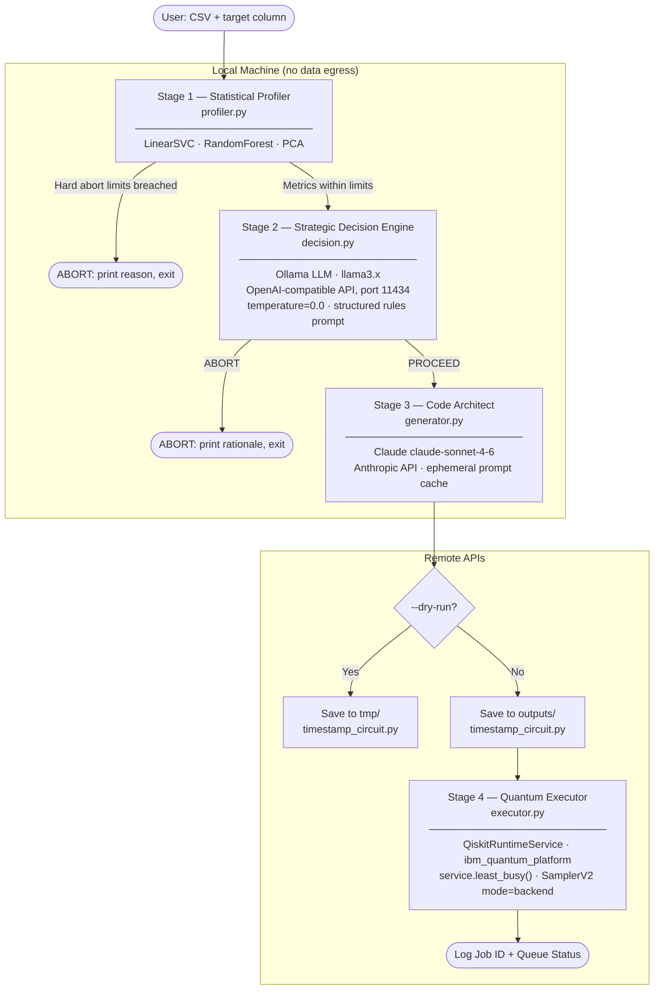
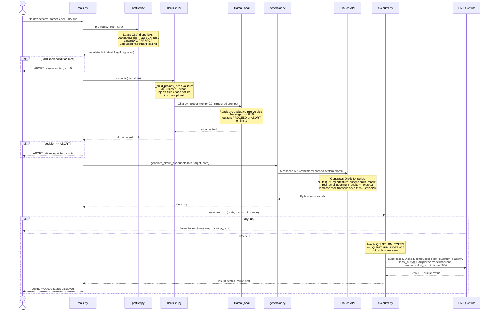
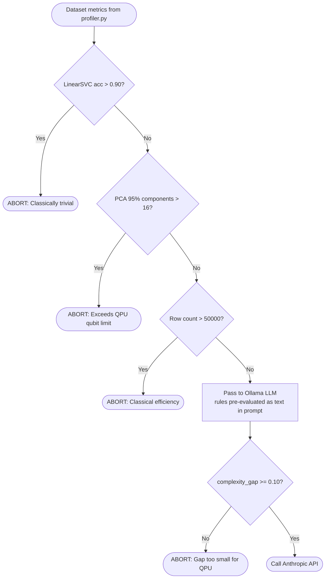

# Architecture: Q-Agent CLI

## Overview

Q-Agent CLI is a four-stage sequential pipeline with embedded circuit-breaker logic. Its primary design goal is **cost and resource protection**: QPU time on IBM Quantum is expensive and constrained, so the system gates every job behind two independent suitability checks before a single API call is made to a paid cloud service.

---

## High-Level Pipeline



---

## Component Diagram

```mermaid
graph LR
    subgraph cli ["CLI (main.py)"]
        M[Argument parser]
        M --> P
        M --> D
        M --> G
        M --> X
    end

    subgraph stage1 ["Stage 1 — profiler.py"]
        P[profile&#40;&#41;]
        P --> P1[StandardScaler\nLabelEncoder]
        P --> P2[LinearSVC C=1000]
        P --> P3[RandomForestClassifier]
        P --> P4[PCA 95% variance]
        P1 & P2 & P3 & P4 --> PM[(metadata JSON\n+ abort flag if triggered)]
    end

    subgraph stage2 ["Stage 2 — decision.py"]
        D[evaluate&#40;&#41;]
        PM --> D
        D --> BP[_build_prompt&#40;&#41;\npre-evaluates all rules\nin Python before LLM call]
        BP --> OL[(Ollama\nlocalhost:11434\ntemp=0.0)]
        OL --> DEC{"PROCEED or ABORT?"}
    end

    subgraph stage3 ["Stage 3 — generator.py"]
        G[generate_circuit_code&#40;&#41;]
        DEC -->|PROCEED| G
        PM --> G
        G --> AN[(Anthropic API\nclaude-sonnet-4-6\nephemeral cache)]
        AN --> CODE[(Qiskit 2.x\nPython script)]
    end

    subgraph stage4 ["Stage 4 — executor.py"]
        X[save_and_run&#40;&#41;]
        CODE --> X
        X -->|dry-run| TMP[(tmp/)]
        X -->|live| OUT[(outputs/)]
        OUT --> SUB[subprocess.run\ninjects QISKIT_IBM_TOKEN]
        SUB --> IBM[(IBM Quantum\nSamplerV2&#40;mode=backend&#41;)]
    end
```



---

## Data Flow



---

## Decision Logic (Circuit Breaker)



There are two independent abort layers:

1. **Hard limits** (`profiler.py`) — deterministic Python threshold checks run before any network call. Fast and free.
2. **LLM judgment** (`decision.py`) — Ollama evaluates the complexity gap. The prompt pre-computes all rule verdicts in Python and injects them as plain text (`"does not fire"` / `"FIRES → ABORT"`), with an explicit numeric gap threshold (≥ 0.10 → PROCEED). `temperature=0.0` ensures deterministic output. This prevents the model from inventing stricter standards than specified.

---

## Qiskit 2.x API Reference

The following API facts were verified against the Qiskit 2.4.x source and IBM Runtime during development. All are enforced in the `generator.py` prompts.

| API | Correct usage | Common mistake |
| :--- | :--- | :--- |
| Feature map | `zz_feature_map(feature_dimension=n, reps=1)` | Using `num_qubits=` (wrong arg name) |
| Ansatz | `real_amplitudes(num_qubits=n, reps=1)` | Using class `RealAmplitudes(...)` (deprecated 2.1) |
| Sampler | `SamplerV2(mode=backend)` | Using `SamplerV2(backend=backend)` (wrong arg name) |
| Auth channel | `channel='ibm_quantum_platform'` | `channel='ibm_quantum'` (retired) |
| Instance | `instance=os.getenv('QISKIT_IBM_INSTANCE') or None` | Passing empty string `""` (raises IBMInputValueError) |
| Circuit build order | compose sub-circuits first, transpile the combined circuit once | Transpiling sub-circuits separately (incompatible qubit registers) |

### Why single-pass transpilation is mandatory

`transpile(circuit, backend)` maps logical qubits to physical backend qubits. Two circuits transpiled independently receive different physical qubit mappings and cannot be composed:

```
❌ Wrong
feature_map_t = transpile(feature_map, backend)   # logical q0 → physical q3
ansatz_t      = transpile(ansatz, backend)         # logical q0 → physical q7
qc.compose(feature_map_t, inplace=True)            # CircuitError: incompatible qubit registers
qc.compose(ansatz_t, inplace=True)

✅ Correct
qc = QuantumCircuit(n)
qc.compose(feature_map, inplace=True)              # logical → logical (compatible)
qc.compose(ansatz, inplace=True)
qc.measure_all()
qc_t = transpile(qc, backend, optimization_level=1)  # one physical mapping for the full circuit
sampler.run([qc_t.assign_parameters(params)])
```

---

## Design Decisions

### 1. Local-first evaluation before remote API calls

All benchmarking (Stage 1) and the suitability decision (Stage 2) run fully locally. No raw dataset rows are sent to any external service. The Anthropic API is only called *after* a local LLM has already approved the job.

**Rationale:** QPU time and Anthropic API tokens both have real costs. A fast, free local screen eliminates wasted spend on datasets that will never benefit from quantum computing.

---

### 2. Separate LLM roles: Ollama for strategy, Claude for code

The Ollama LLM acts as a strategic gatekeeper — it reasons about *whether* to proceed. Claude acts as a code generator — it produces precise, syntactically correct Qiskit 2.x Python. These are distinct tasks with different capability requirements.

**Rationale:** A local quantised model (llama3 via Ollama) is well-suited to structured yes/no reasoning over a small JSON document and runs with zero latency or cost. It is unreliable for Qiskit 2.x code generation. Claude is the opposite: expensive per call, but highly reliable for code involving specific library versions and APIs.

**Lesson learned:** An open-ended prompt ("does the gap justify a quantum kernel?") allowed the LLM to invent stricter standards than specified, causing spurious ABORTs. The fix was to pre-evaluate all rules in Python and inject the verdict as plain text, leaving the LLM only the task of reading the result — not computing it.

---

### 3. Prompt caching on the Claude system prompt

`generator.py` attaches `cache_control: {type: "ephemeral"}` to the system prompt. The system prompt contains all Qiskit 2.x constraints. It is identical on every call; only the user prompt (dataset metadata) changes.

**Rationale:** Anthropic charges full price for input tokens on the first call and a heavily discounted rate on subsequent cache hits. In a workflow where the tool is run repeatedly against different datasets, this materially reduces cost per run.

---

### 4. OpenAI SDK for Ollama

Ollama exposes an OpenAI-compatible `/v1/chat/completions` endpoint. `decision.py` uses the `openai` Python SDK pointed at `http://localhost:11434/v1`.

**Rationale:** Avoids adding a dedicated `ollama` SDK dependency. The `openai` package is already required and provides a stable, typed client. Switching models requires only changing the `OLLAMA_MODEL` environment variable.

---

### 5. Generated code runs as a subprocess

The Qiskit script produced by Claude is saved to disk and executed via `subprocess.run`. IBM Quantum authentication tokens are injected into the subprocess environment — not embedded in the script.

**Rationale:** Subprocess execution provides a clean isolation boundary — the generated code's imports, global state, and exceptions cannot affect the parent process. The script is a first-class, human-readable artefact that can be inspected, modified, and re-run independently. Tokens injected via environment variables means scripts in `outputs/` are safe to inspect without credential exposure.

---

### 6. Dual output directories: `outputs/` vs `tmp/`

Live runs save to `outputs/` (tracked by git, permanent). Dry-runs save to `tmp/` (gitignored, but project-local so files survive reboots — unlike the system `/tmp`).

**Rationale:** `outputs/` is the auditable record of scripts submitted to IBM Quantum. `tmp/` is a scratch space for reviewing generated code before committing QPU resources. The filesystem distinction makes "reviewed and submitted" vs "draft" explicit.

---

### 7. Circuit sizing for PoC QPU execution

The PROCEED test dataset uses 4 features (→ 4 qubits) and `reps=1` for both the feature map and ansatz. This reduces circuit depth from ~96 gates (8-qubit, reps=2) to ~20 gates, and reduces the maximum circuit execution count from ~90,000 to ~20,000.

**Rationale:** A PoC needs to complete in a reasonable time on real hardware. The XOR-like phase boundary in the dataset preserves the statistical properties that justify a quantum kernel (gap=0.47) while keeping the circuit shallow enough to run without cancellation.

---

## File Reference

| File | Stage | External dependency |
|---|---|---|
| `main.py` | Orchestrator | None |
| `profiler.py` | 1 — Statistical Profiler | scikit-learn, pandas, numpy |
| `decision.py` | 2 — Decision Engine | Ollama (local), openai SDK |
| `generator.py` | 3 — Code Architect | Anthropic API |
| `executor.py` | 4 — Quantum Executor | IBM Quantum (qiskit-ibm-runtime) |
| `generate_test_data.py` | Test data generation | scikit-learn, pandas, numpy |
| `data/test_dataset_abort.csv` | Test — ABORT path | — |
| `data/test_dataset_run.csv` | Test — PROCEED path | — |
