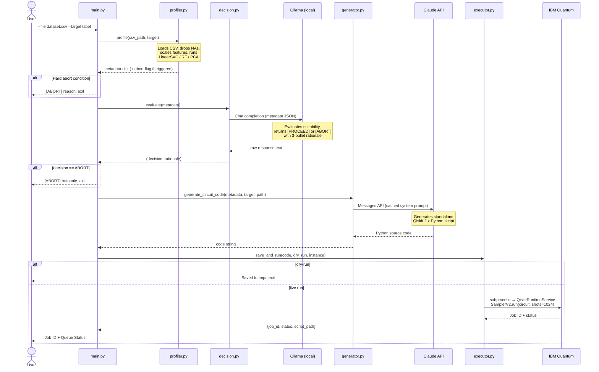

# Architecture: Q-Agent CLI

## Overview

Q-Agent CLI is a four-stage sequential pipeline with embedded circuit-breaker logic. Its primary design goal is **cost and resource protection**: QPU time on IBM Quantum is expensive and constrained, so the system gates every job behind two independent suitability checks before a single API call is made to a paid cloud service.

---

## High-Level Pipeline

```mermaid
flowchart TD
    A([User: CSV + target column]) --> B

    subgraph LOCAL ["Local Machine (no data egress)"]
        B["Stage 1 — Statistical Profiler\nprofiler.py\n―――――――――――――――――\nLinearSVC · RandomForest · PCA"]
        B -->|Hard abort limits breached| C1([ABORT: print reason, exit])
        B -->|Metrics within limits| D

        D["Stage 2 — Strategic Decision Engine\ndecision.py\n―――――――――――――――――\nOllama LLM  ·  llama3\n(OpenAI-compatible API, port 11434)"]
        D -->|[ABORT]| C2([ABORT: print rationale, exit])
        D -->|[PROCEED]| E
    end

    subgraph REMOTE ["Remote APIs"]
        E["Stage 3 — Code Architect\ngenerator.py\n―――――――――――――――――\nClaude claude-sonnet-4-6\n(Anthropic API · prompt caching)"]
        E --> F

        F{"--dry-run?"}
        F -->|Yes| G1["Save to tmp/\n{timestamp}_circuit.py"]
        F -->|No| G2["Save to outputs/\n{timestamp}_circuit.py"]
        G2 --> H

        H["Stage 4 — Quantum Executor\nexecutor.py\n―――――――――――――――――\nQiskitRuntimeService\nSamplerV2 · ibm_quantum_platform"]
        H --> I([Log Job ID + Queue Status])
    end
```

---

## Component Diagram

```mermaid
graph LR
    subgraph cli ["CLI (main.py)"]
        M[Argument parser]
        M --> P
        M --> D
        M --> G
        M --> X
    end

    subgraph stage1 ["Stage 1 — profiler.py"]
        P[profile&#40;&#41;]
        P --> P1[StandardScaler\nLabelEncoder]
        P --> P2[LinearSVC C=1000]
        P --> P3[RandomForestClassifier]
        P --> P4[PCA 95% variance]
        P1 & P2 & P3 & P4 --> PM[(metadata JSON)]
    end

    subgraph stage2 ["Stage 2 — decision.py"]
        D[evaluate&#40;&#41;]
        PM --> D
        D --> OL[(Ollama\nlocalhost:11434)]
        OL --> DEC{PROCEED\nor ABORT?}
    end

    subgraph stage3 ["Stage 3 — generator.py"]
        G[generate_circuit_code&#40;&#41;]
        DEC -->|PROCEED| G
        PM --> G
        G --> AN[(Anthropic API\nclaude-sonnet-4-6)]
        AN --> CODE[(Qiskit 2.x\nPython script)]
    end

    subgraph stage4 ["Stage 4 — executor.py"]
        X[save_and_run&#40;&#41;]
        CODE --> X
        X -->|dry-run| TMP[(tmp/)]
        X -->|live| OUT[(outputs/)]
        OUT --> IBM[(IBM Quantum\nSamplerV2)]
    end
```



---

## Data Flow



---

## Decision Logic (Circuit Breaker)

```mermaid
flowchart TD
    A([Dataset metrics]) --> B{LinearSVC acc\n> 0.90?}
    B -->|Yes| ABORT1([ABORT:\nClassically trivial])
    B -->|No| C{PCA 95% components\n> 16?}
    C -->|Yes| ABORT2([ABORT:\nExceeds QPU qubit limit])
    C -->|No| D{Row count\n> 50,000?}
    D -->|Yes| ABORT3([ABORT:\nClassical efficiency])
    D -->|No| E[Pass to Ollama LLM]
    E --> F{Ollama decision\nstarts with?}
    F -->|[ABORT]| ABORT4([ABORT:\nOllama rationale printed])
    F -->|[PROCEED]| G([Call Anthropic API])
```

There are two independent abort layers:

1. **Hard limits** (`profiler.py`) — deterministic threshold checks. These run entirely locally before any network call and catch the most obvious cases cheaply.
2. **Reasoned judgment** (`decision.py`) — the Ollama LLM applies the same rules but also assesses the *Classical Gap* (`RF score − LinearSVC score`). A high gap suggests non-linear structure that a quantum kernel might exploit. This layer can `[ABORT]` even when hard limits are not breached, for example if the gap is negligible despite a borderline row count.

---

## Design Decisions

### 1. Local-first evaluation before remote API calls

All benchmarking (Stage 1) and the suitability decision (Stage 2) run fully locally. No raw dataset rows are sent to any external service. The Anthropic API is only called *after* a local LLM has already approved the job.

**Rationale:** QPU time and Anthropic API tokens both have real costs. A fast, free local screen eliminates wasted spend on datasets that will never benefit from quantum computing.

---

### 2. Separate LLM roles: Ollama for strategy, Claude for code

The Ollama LLM acts as a strategic gatekeeper — it reasons about *whether* to proceed. Claude acts as a code generator — it produces precise, syntactically correct Qiskit 2.x Python. These are distinct tasks with different capability requirements.

**Rationale:** A local quantised model (llama3 via Ollama) is well-suited to structured yes/no reasoning over a small JSON document and runs with zero latency or cost. It would produce unreliable Qiskit 2.x code. Claude is the opposite: expensive per call, but highly reliable for code generation involving specific library versions and APIs. Separating the roles optimises cost and accuracy.

---

### 3. Prompt caching on the Claude system prompt

`generator.py` attaches `cache_control: {type: "ephemeral"}` to the system prompt. The system prompt contains all the Qiskit 2.x constraints (function forms, SamplerV2, auth pattern). It is identical on every call; only the user prompt (dataset metadata) changes.

**Rationale:** The system prompt is ~400 tokens. Anthropic charges full price for input tokens on the first call and a heavily discounted rate on subsequent cache hits. In a workflow where the same tool is run repeatedly against different datasets, this materially reduces cost.

---

### 4. OpenAI SDK for Ollama

Ollama exposes an OpenAI-compatible `/v1/chat/completions` endpoint. `decision.py` uses the `openai` Python SDK pointed at `http://localhost:11434/v1`.

**Rationale:** Avoids adding a dedicated `ollama` SDK dependency. The `openai` package is already a transitive dependency and provides a stable, typed client. Switching Ollama models requires only changing the `OLLAMA_MODEL` environment variable.

---

### 5. Generated code runs as a subprocess

The Qiskit circuit script produced by Claude is saved to disk and executed via `subprocess.run`. IBM Quantum authentication tokens are injected into the subprocess environment rather than embedded in the script.

**Rationale:** Executing as a subprocess provides a clean isolation boundary — the generated code's imports, global state, and any exceptions are fully contained and cannot affect the parent process. It also means the generated script is a first-class, human-readable artefact that can be inspected, modified, and re-run independently. Tokens are passed via environment variables rather than hardcoded into the file, so scripts saved to `outputs/` or `tmp/` are safe to share or commit (provided the `.gitignore` rules are respected).

---

### 6. Dual output directories: `outputs/` vs `tmp/`

Live runs save scripts to `outputs/` (tracked by git, permanent). Dry-runs save to `tmp/` (gitignored, but project-local so files survive reboots — unlike `/tmp` which is cleared on restart).

**Rationale:** `outputs/` is the record of scripts that were actually submitted to IBM Quantum. `tmp/` is a scratch space for reviewing generated code before committing QPU resources. Keeping them separate makes the distinction between "reviewed and submitted" vs "draft" explicit in the filesystem.

---

## File Reference

| File | Stage | External dependency |
|---|---|---|
| `main.py` | Orchestrator | None |
| `profiler.py` | 1 — Statistical Profiler | scikit-learn, pandas, numpy |
| `decision.py` | 2 — Decision Engine | Ollama (local), openai SDK |
| `generator.py` | 3 — Code Architect | Anthropic API |
| `executor.py` | 4 — Quantum Executor | IBM Quantum (qiskit-ibm-runtime) |
